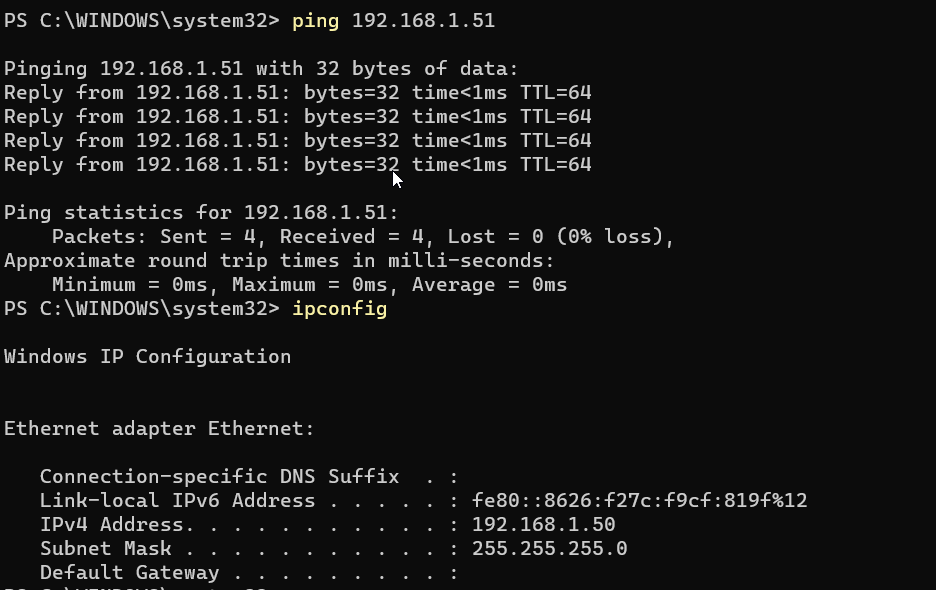

# Labbdokumentation: Labbmiljö,Git,CLI,AI
**Namn:** Diana  
**Datum:** 15 September 2026  
**Kurs:** Introduktion till yrkesrollen och grunderna i IT-infrastruktur  


**Introduktion:** Detta är en labbmiljö som går igenom virituell labbmiljö, felsökning och sedan dokumenterars i Git med hjälp av Markdown format.

---

## Labbmiljö & Nätverk:
| Hostnamn | Operativsystem | IP-adress | Subnätmask | Standard Gateway |
|:--- | :--- | :--- | :--- | :--- |
| Windows 11 | Windows 11 Pro | 192.168.1.50 | 255.255.255.0 | ingen |  
| Linux | Ubuntu 25.04 | 192.168.1.51 | 24 | inget |  

## **Kommandoradsgenomförande**
***Linux***  
 Skapande av mapp och textfil.  
1. ```sudo mkdir -p " mappnamnet"```  
skrev jag in i terminalen för att skapa mappen. För att sedan skapa filen:    

2. ```cd "mappnamnet" och enter```  
 då kom jag in i mappen. Härifrån skrev jag in    

 3. ``` touch "filnamnet"``` 
 nu fick jag felmeddelande : premission denied - skrev då in:   

 4. ```sudo touch "filnamn"```  
För att kontrollera att det fungerade skrev jag in ```ls - filen``` hittades. **Viktigt!** skriv in ls i mappen du skapade filen i för att inte få upp alla mappar på enheten.  
---
 *Skapa grupp och sätt behörighet:*  
 du kan gå tillbaka till start genom att skriv cd ../../.. (antalet "../" beror på hur många / det finns för att komma till den mappen vi skapade )  
 kontrollera du är på hem : **pdw**  

 1. skapa grupp ```sudo groupadd "gruppnamn"``` 

 2. För att ändra behörigheter ``` sudo chgrp "gruppnamnet vi skapade" "sökvägen till mappen vi gjorde"```     

 3. För att sätta behörigheter  
 ```sudo chmod 750 "mappnamnet"```  
  detta ändrar behögiheten för mappen.    

 4. Ändra behörigheter för filen vi skapade
 ```sudo chmod 650 "mappnamnet + /filnamnet"```  
--- 
 750 och 650 är exempel på behörigheter enbart. Kontrollera vad för behörighet som användaren ska ha och utifrån det ändra siffrorna så dom stämmer överrens med behörighetsnivå.   

 **För att kontrollera behörigheterna skriv in**  
  ```ls -ld "mappnamnet"``` -Fick felmeddelande så skrev: sudo ls ld "mappnamn"  

Kontrollerade även ```sudo ls -l``` för att se behörigeter för filen vi skapat och lagt behörighet på.  

---  
 *Pingade Windows datorn och fick inte respons. Gick in på CMD som administratör i Windows och körde script som tillät att Linux Ip får pinga Windows datorn. Pingade igen från Linux datorn och det fungerade.*    

 ***Windows CMD***  
 Via Powershell skriv kommandot  
  ```mkdir C:"mappnamnet"```  
  För att kontorllera att den skapades skriv  
  ```test-path C:\"mappnamnet"```  
  True = Finns  
  False = Finns inte  
  *Inspektion av behörigheter för mappen vi skapade*  
  Kommandot ```Get-Acl "C:\ mappnamnet" | Format-list```  
  Visar ***| Ägare | grupper | behörighet |***   
  Det finns en ägare : *Administratören*. Det finns inga grupper och *Administratörern* har full behörighet.  
### Nedan ser vi en skärmdump av Windows ping och ipconf ### 
  

## Git och Versionshantering ## 
>Ändringshistoriken


[Länk till Git-Repo](https://github.com/Vayas-code/min-forsta-kursuppgift)  

## AI-logg och utvärdering ##  

